# Bebek Ses Çözücü - Akış Diyagramı

## 🔄 Genel Uygulama Akışı

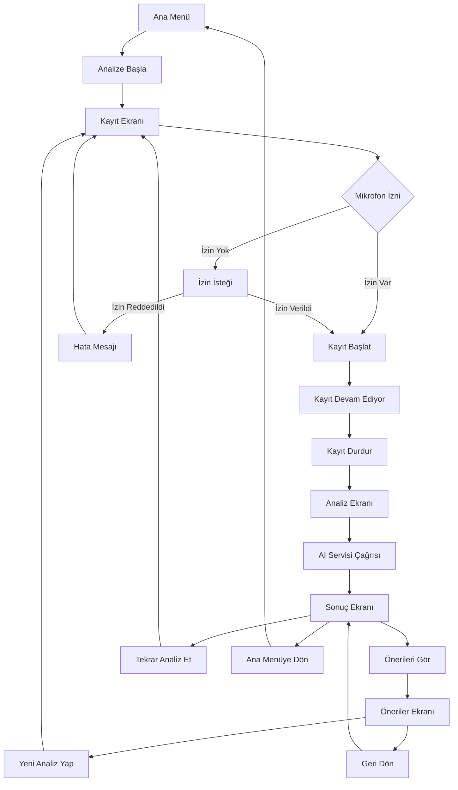

## 📱 Ekran Bazında Detaylı Akış

### 1. Ana Menü (`app/index.tsx`)
```mermaid
graph LR
    A[Ana Menü] --> B[Analize Başla Butonu]
    B --> C[/analyze rotasına git]
```

**Özellikler:**
- Uygulama başlangıç noktası
- Basit ve temiz arayüz
- Tek ana aksiyon butonu

### 2. Kayıt Ekranı (`app/analyze/index.tsx`)
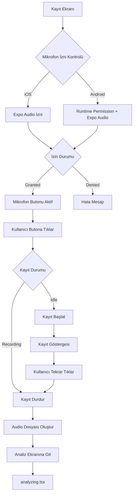

**Durum Yönetimi:**
- `recording: boolean` - Kayıt durumu
- `isProcessing: boolean` - İşlem durumu
- Hata yönetimi ve kullanıcı geri bildirimi

### 3. Analiz Ekranı (`app/analyze/analyzing.tsx`)
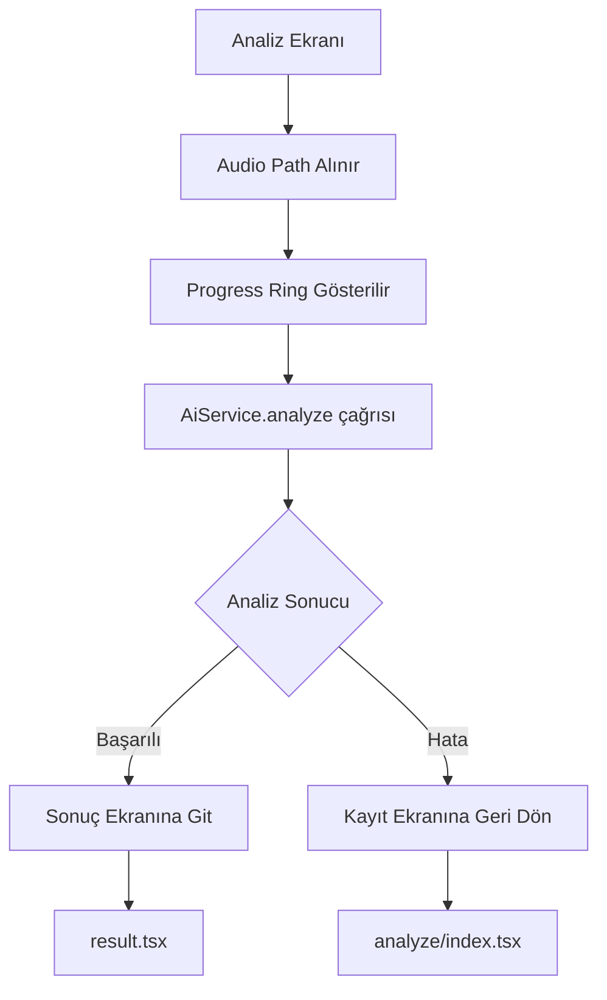

**İşlem Adımları:**
1. Audio path parametresi alınır
2. Loading göstergesi başlatılır
3. AI servisi çağrılır (mock data)
4. Sonuç ekranına yönlendirme

### 4. Sonuç Ekranı (`app/analyze/result.tsx`)
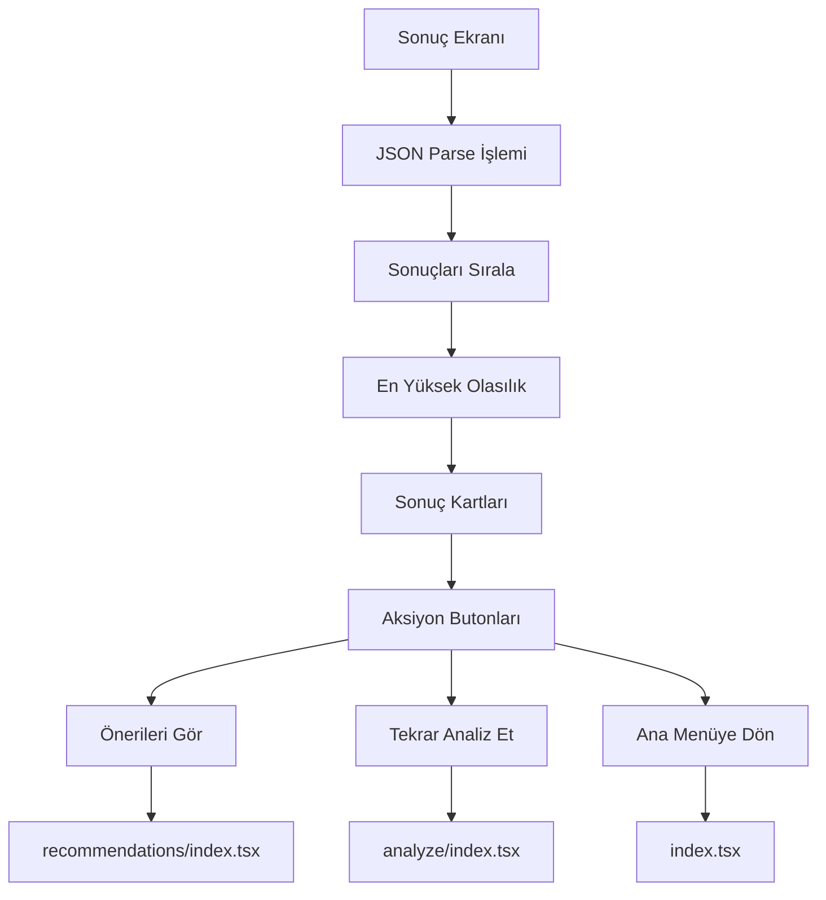

**Veri İşleme:**
- JSON parse ve hata kontrolü
- Yüzdelik sıralama
- Renk kodlaması (Açlık: yeşil, Gaz: turuncu, Yorgunluk: mavi)

### 5. Öneriler Ekranı (`app/recommendations/index.tsx`)
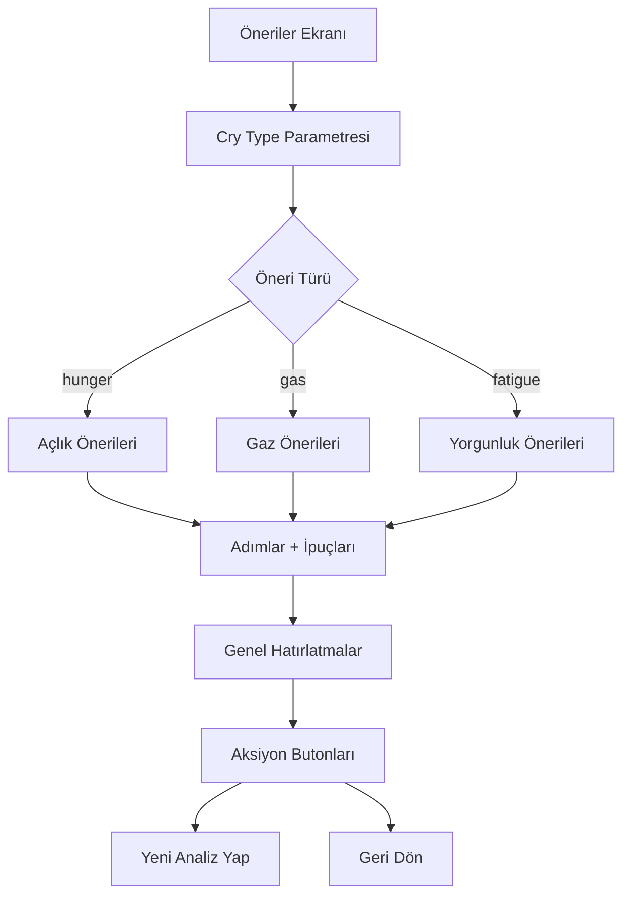

## 🔧 Teknik Akış Diyagramları

### AI Servisi Akışı
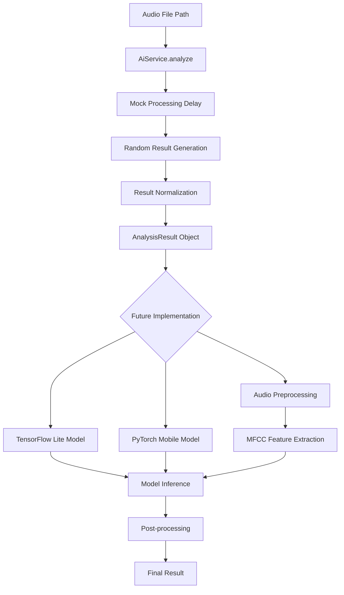

### Hata Yönetimi Akışı
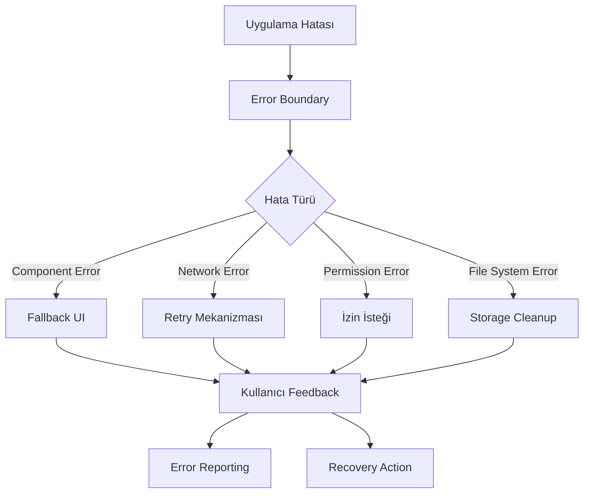

### Veri Akışı
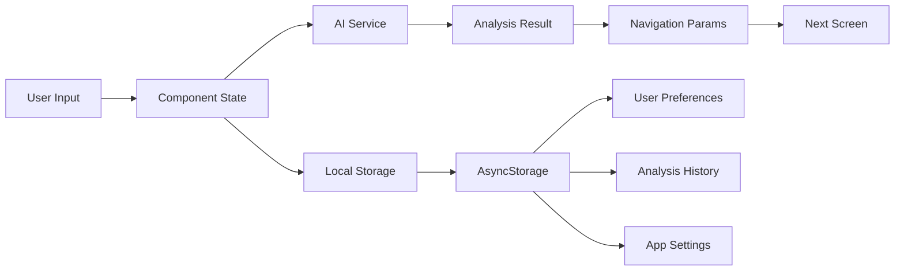

## 📊 Durum Makinesi

### Kayıt Durum Makinesi
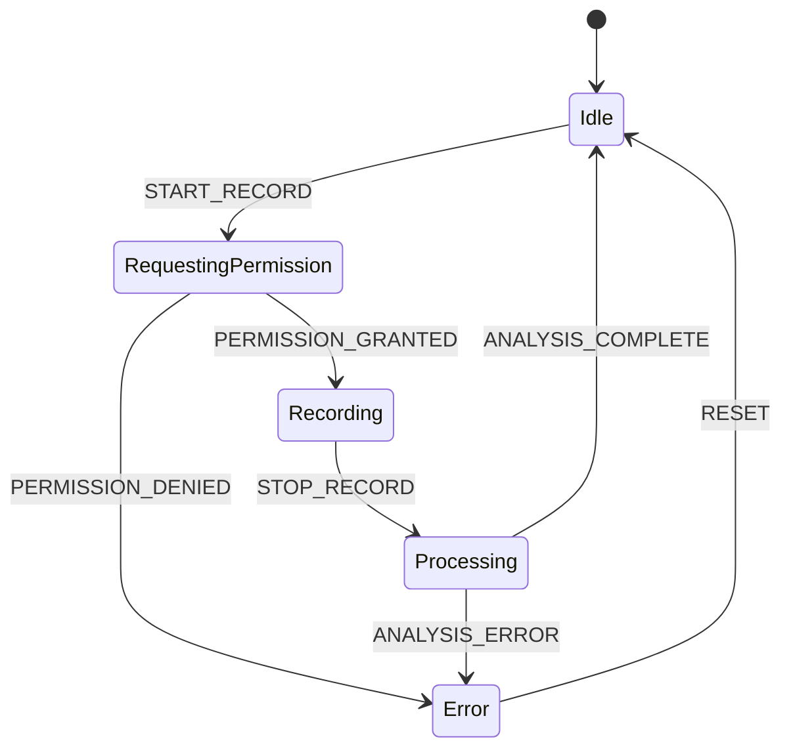

### Uygulama Durumları
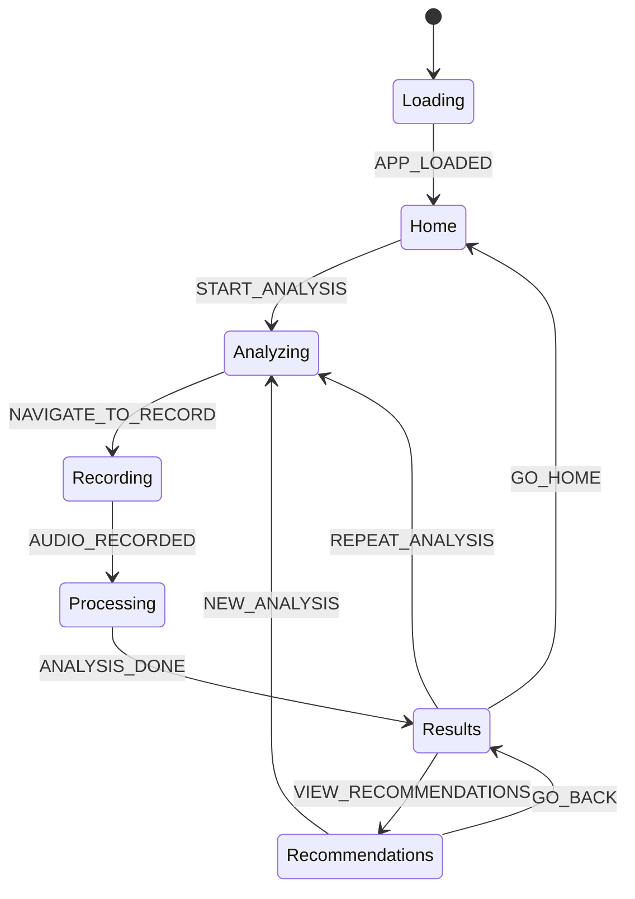

## 🔄 Veri Akış Patterns

### Component Props Flow
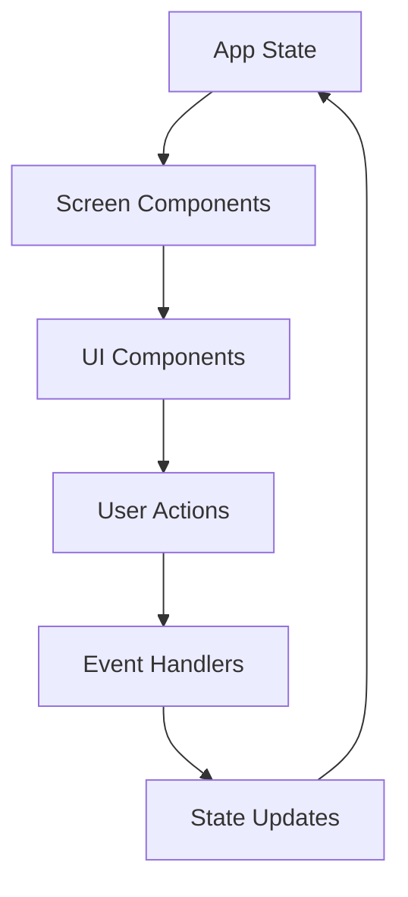

### Service Layer Integration
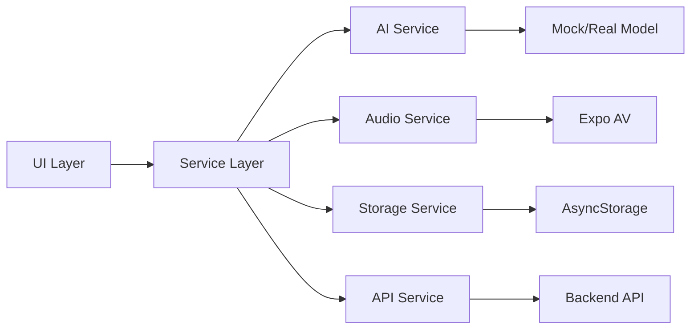

Bu diyagramlar, uygulamanın tüm akışlarını ve bileşenler arası etkileşimlerini detaylı bir şekilde göstermektedir. Geliştirme sürecinde referans olarak kullanılabilir.